# Daily-Expenses-Sharing-Application

A backend application built with Node.js, Express, and MongoDB that allows users to manage daily expenses, split them using different methods, and generate balance sheets in Excel format.

## Setup

1. Clone the repository:
   ```
   git clone https://github.com/a3mxn/Daily-Expenses-Sharing-Application.git
   ```

2. Navigate to the project directory:
   ```
   cd Daily-Expenses-Sharing-Application
   ```

3. Install dependencies:
   ```
   npm install
   ```

4. Create a .env file in the root directory and add your environment variables:
   ```
   MONGO_URI=your-mongodb-connection-string
   JWT_SECRET=your-jwt-secret
   PORT=your-port-number
   ```

5. Start the server:
   ```
   npm start
   ```

## Data Models

### User Model

| Field    | Type   | Required | Unique |
|----------|--------|----------|--------|
| username | String | Yes      | No     |
| email    | String | Yes      | Yes    |
| password | String | Yes      | No     |
| mobile   | String | Yes      | No     |

### Expense Model

| Field          | Type                                                                 | Required |
|----------------|----------------------------------------------------------------------|----------|
| userId         | mongoose ObjectId (ref: 'User  ')                        | Yes      |
| description    | String                                                              | Yes      |
| amount         | Number                                                              | Yes      |
| participants    | Array of mongoose ObjectId (ref: 'User  ')              | No       |
| splitMethod    | String (enum: ['equal', 'exact', 'percentage'])                    | Yes      |
| exactAmounts   | Array of objects (userId: ObjectId, amount: Number)                | No       |
| percentages     | Array of objects (userId: ObjectId, percentage: Number)            | No       |

## Endpoints

### User Routes

| Method | Endpoint            | Parameters                                      | Usage                                                                                       |
|--------|---------------------|-------------------------------------------------|--------------------------------------------------------------------------------------------|
| POST   | /api/user/signup    | - username: String<br>- email: String<br>- password: String<br>- mobile: String | Create a new user account. Returns a JSON Web Token (JWT) for authentication. |
| POST   | /api/user/login     | - email: String<br>- password: String          | Log in to an existing user account. Returns a JWT for authentication.        |
| GET    | /api/user/getuser   | No parameters required                          | Retrieve the currently logged-in user's details.                              |
| GET    | /api/user/          | No parameters required                          | Retrieve a list of all registered users.                                       |

### Expense Routes

| Method | Endpoint                        | Parameters                                                                 | Usage                                                                                       |
|--------|---------------------------------|----------------------------------------------------------------------------|--------------------------------------------------------------------------------------------|
| GET    | /api/expense/                  | No parameters required                                                    | Retrieve a list of all expenses.                                                         |
| POST   | /api/expense/                  | - description: String<br>- amount: Number<br>- participants: Array of ObjectIds<br>- splitMethod: "equal or exact or percentage"<br>- exactAmounts (if splitMethod is "exact")<br>    - userId: ObjectId<br>    - amount: Number<br>- percentages (if splitMethod is "percentage")<br>    - userId: ObjectId<br>    - percentage: Number | Create a new expense. Returns the created expense document. |
| GET    | /api/expense/balance-sheet     | No parameters required                                                    | Retrieve the balance sheet for the currently logged-in user.                    |
| POST   | /api/expense/generate-balance-sheet | No parameters required                                                    | Generate and download the balance sheet for the currently logged-in user.      |

## Other Features

- **jsonwebtoken**: Token-based user authentication.
- **bcrypt**: Secure password hashing and salting.
- **Flexible Login Options**: Log in using email, mobile, or username.
- **Authorization Middleware**: Protect routes for authenticated users.
- **Error Handling & Validation**: Comprehensive error handling and input validation.
- **Performance Optimization**: Optimized for handling large datasets.
- **Unit & Integration Tests**: Unit and integration testing for reliability.
- **cookie-parser**: Secure session management with cookies.
- **CORS**: Cross-Origin Resource Sharing enabled for API requests.
- **dotenv**: Secure management of environment variables.
- **Mongoose**: Efficient MongoDB interactions using Mongoose.
- **Nodemon**: Automatic server restarts during development.
- **xlsx**: Generates downloadable balance sheets in Excel format.

## API Testing
### Signup Controller
Endpoint route = /api/user/signup <br>
Method = POST
``` sample json
{
    "username": "userexample",
    "email": "userexample@email.com",
    "password": "userpassword",
    "mobile": "123456789"
}
```
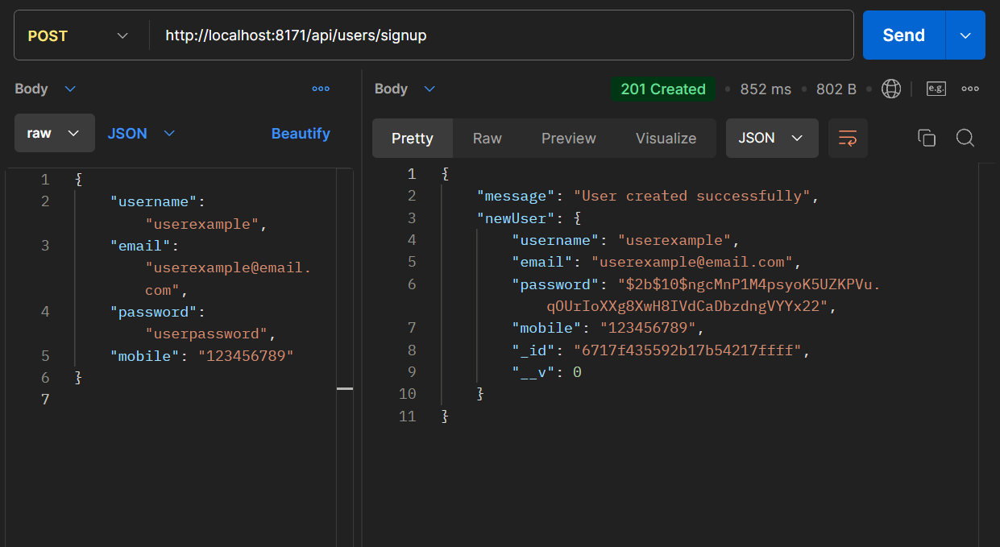
### LogIn Controller
Endpoint route = /api/user/login <br>
Method = POST
```sample json
{
    "loginIdentifier": "userexample",
    "password": "userpassword"
}
```
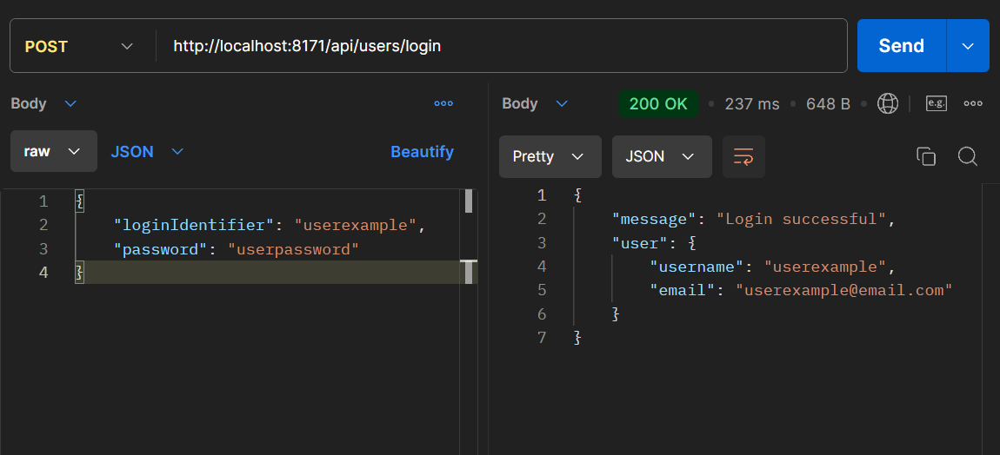
### GetUser Controller
Endpoint route = /api/user/login <br>
Method = GET <br>
sample json = empty <br>
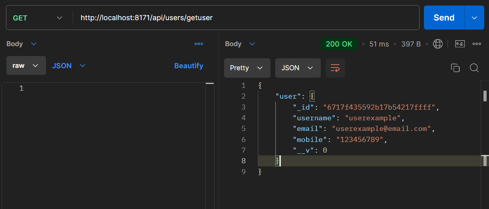

### Get all users Controller
Endpoint route = /api/user/ <br>
Method = GET <br>
sample json = empty <br>
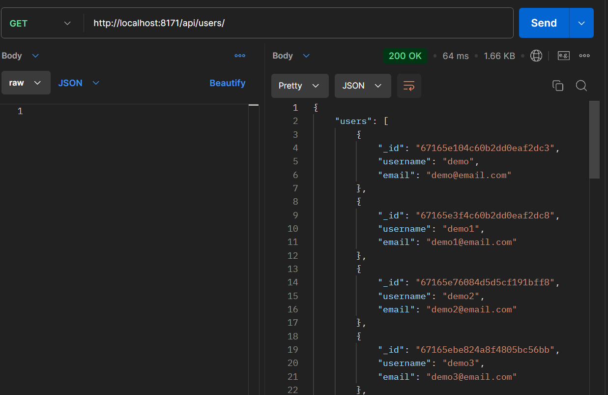

### GetExpenses Controller
Endpoint route = /api/expense/ <br>
Method = GET <br>
sample json = empty <br>
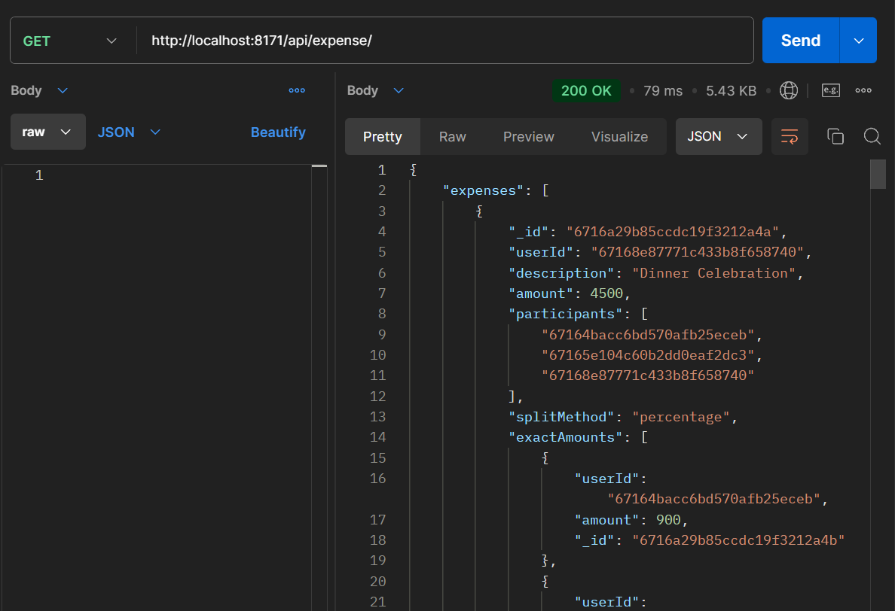

### AddExpenses Controller
Endpoint route = /api/expense/ <br>
Method = POST <br>
paste any one of the following data one time in json body, each one signify split in equal,exact,percentage respectively
```sample json
//data is in json format
//equal split

{
    "description": "Lunch with friends",
    "amount": 3000,
    "participants": [
        "67164bacc6bd570afb25eceb",
        "67165e104c60b2dd0eaf2dc3",
        "67168e87771c433b8f658740"
    ],
    "splitMethod": "equal",
    "exactAmounts": [],
    "percentages": []
}


// unequal but exact split

{
    "description": "Movie Night",
    "amount": 2000,
    "participants": [
        "67164bacc6bd570afb25eceb",
        "67165e104c60b2dd0eaf2dc8",
        "67168e87771c433b8f658740"
    ],
    "splitMethod": "exact",
    "exactAmounts": [
        { "userId": "67164bacc6bd570afb25eceb", "amount": 500 },
        { "userId": "67165e104c60b2dd0eaf2dc8", "amount": 700 },
        { "userId": "67168e87771c433b8f658740", "amount": 800 }
    ],
    "percentages": []
}


//percentage split

{
    "description": "Dinner Celebration",
    "amount": 4500,
    "participants": [
        "67164bacc6bd570afb25eceb",
        "67165e104c60b2dd0eaf2dc3",
        "67168e87771c433b8f658740"
    ],
    "splitMethod": "percentage",
    "exactAmounts": [],
    "percentages": [
        { "userId": "67164bacc6bd570afb25eceb", "percentage": 20 },
        { "userId": "67165e104c60b2dd0eaf2dc3", "percentage": 30 },
        { "userId": "67168e87771c433b8f658740", "percentage": 50 }
    ]
}
```
<br>Equal split
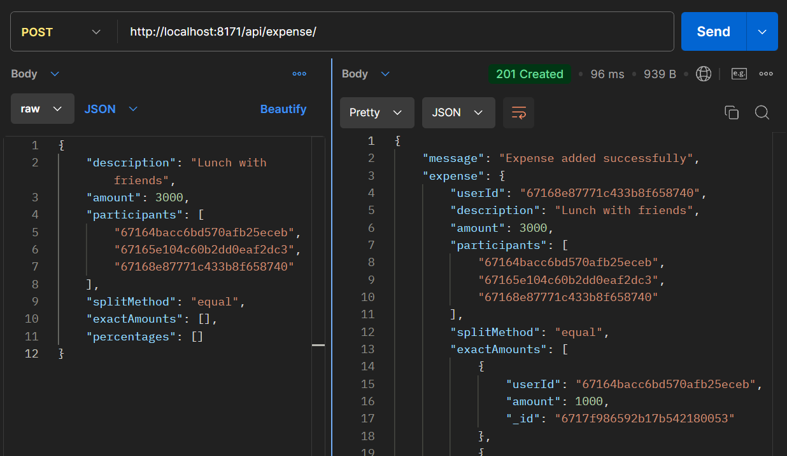 <br> Exact Split <br>
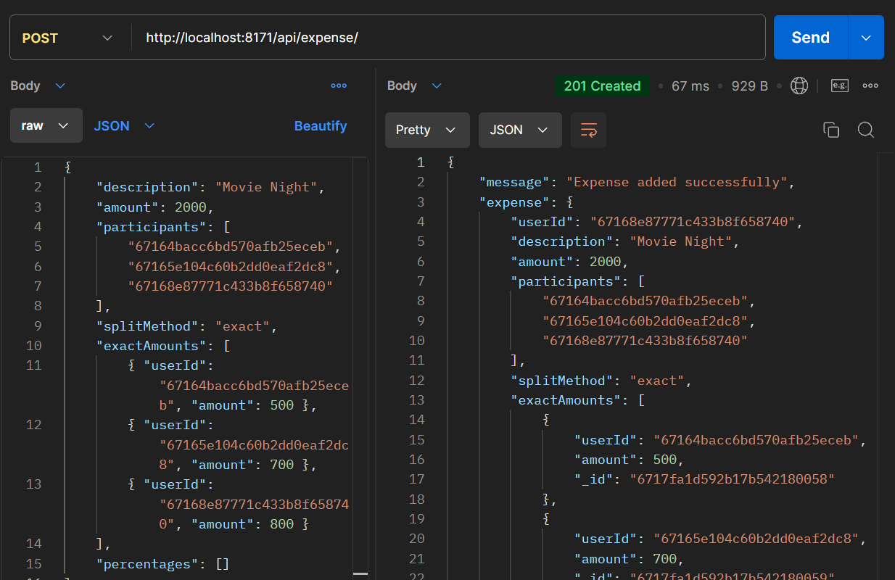 <br> Percentage Split <br>
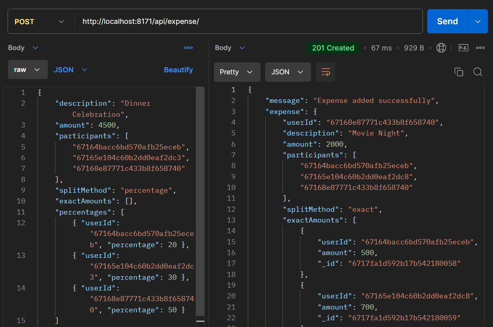

### Balance Sheet
Endpoint route = /api/expense/balance-sheet <br>
Method = GET <br>
sample json = empty <br>
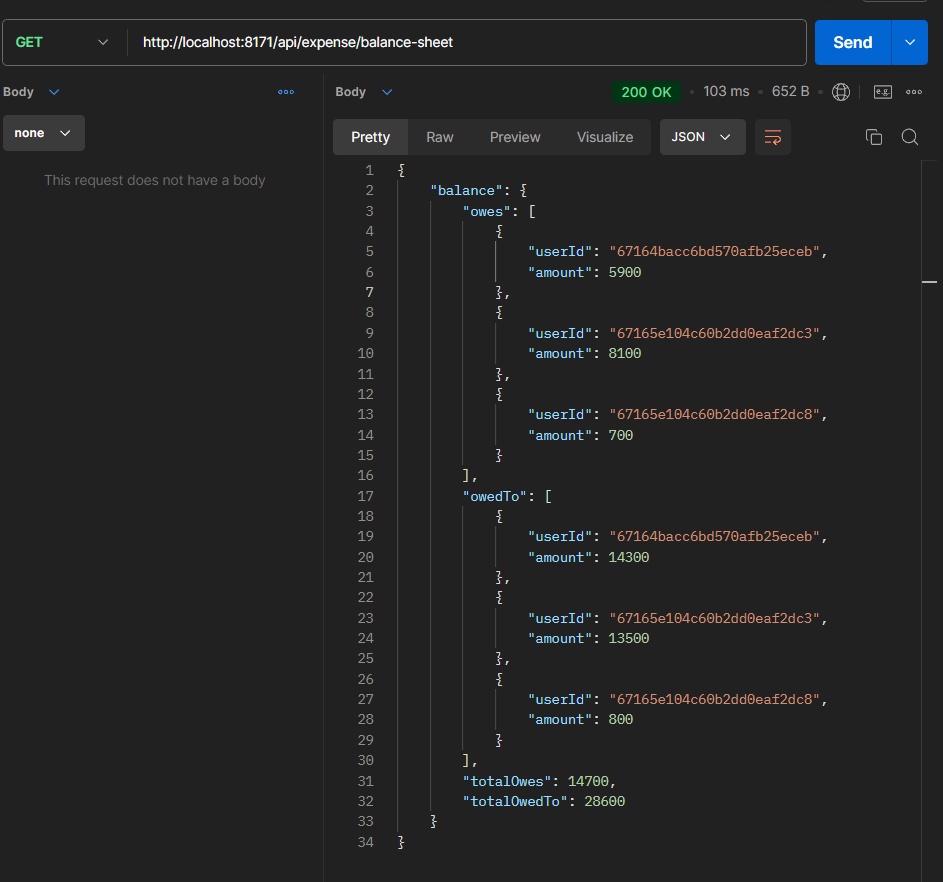

### Download Balance-Sheet
Endpoint route = /api/expense/balance-sheet <br>
Method = GET <br>
sample json = empty <br>
ensure to send request using "send and download" in postman <br>
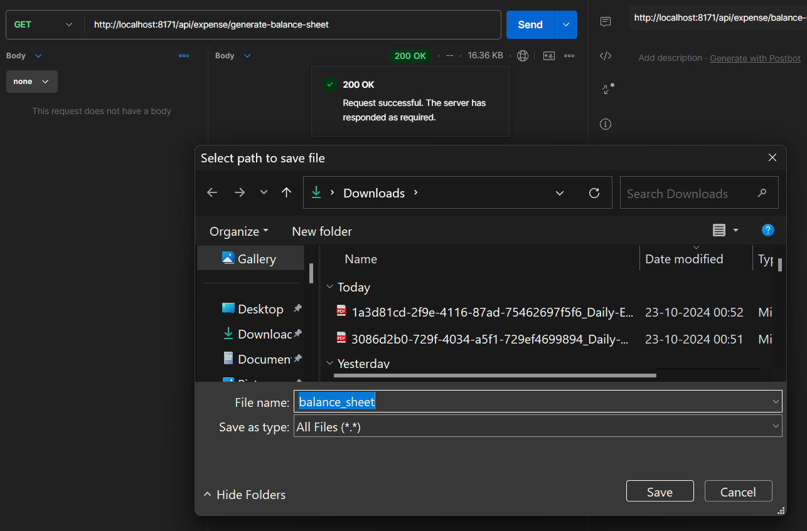
Downloaded Sample of excel sheet <br>
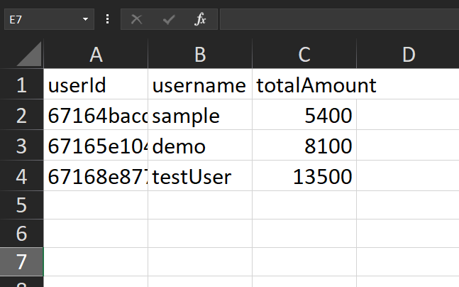
